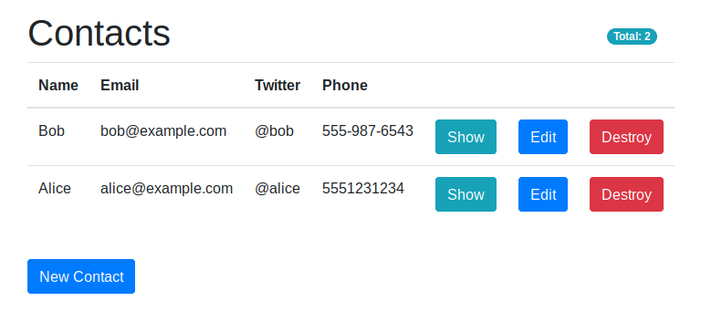
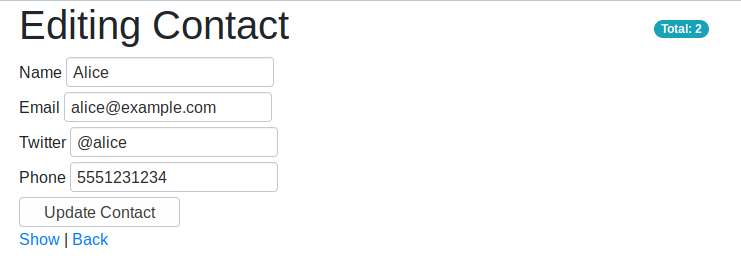
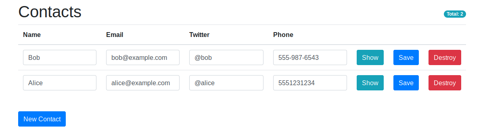
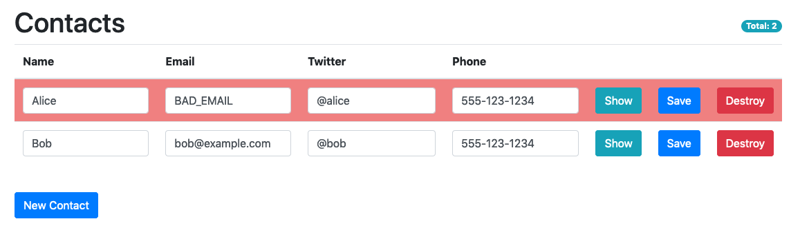

# Your Rails devs will want to write JS: Svelte Components in HTML Apps


Svelte is a new frontend framework that can work particularly well within a traditional server-rendered app. If you're already familiar with Svelte and just want to get to the integration, you might want to skip to it [here](#Rails-Integration). Otherwise read on!


At Carbon Five, we try to be agile about our technology choices and pick the simplest tool for the job at hand. That means that even in 2019, the era of React and Redux and GraphQL and all the other fancy tools for client-side web applications, sometimes the best tool for our clients is a good old Rails app, serving HTML.

Often the vision for the project pushes us towards an Single Page Application instead — maybe the app is going to be highly interactive or include realtime data, or the client is already invested in a front-end framework. In those cases, of course we'll reach for React (or Angular or Vue). But for the traditional CRUD app that just needs to show some data and let users update it, a small team of experienced Rails developers can get an idea to market incredibly quickly.

Sometimes we find ourselves adding a few API routes and a bit of client-side jQuery to make pieces of UI refresh a little more often, or check their validity, or some other small quality of life improvement. The jQuery's not ideal, but there's a feeling of "we don't want to pull in a whole front-end framework just for this."

Then it happens. That moment where the dev teams says "oh no, should we have used React?" Maybe a users say the interface feels “clunky." Or maybe the next big feature is wizard, with lots of state, conditional fields based on values from previous pages, a dynamic progress bar, validation that should warn you about missing data but not stop you from progressing until you try to submit... the stuff they invented SPAs to deal with.

That doesn't mean the team made a mistake going with Rails! SPAs add drag to any project, and if you can get an MVP out faster without one then you're in a great place. But still, it would be nice if there was something in between; something that had the size and simplicity of jQuery, with the more powerful declarative abstractions of React.

## Svelte to the Rescue

This is where Svelte comes in. Svelte is a pretty new framework that only got its final v3 shape in [April](https://svelte.dev/blog/svelte-3-rethinking-reactivity). So it's a little bleeding edge. But Svelte 1 and 2 have been going since 2016, and it's gotten to be a pretty slick little framework.

And little is the right word. The idea behind Svelte is that humans like writing declarative code (like React), but the browser prefers imperative changes (like with jQuery). So Svelte isn't actually a runtime library. It's a compiler that takes React-like component code and turns it into a set of watches and DOM manipulations. That means builds are smaller and performance is better. And maybe more importantly, because it's a compiler, Svelte lets you spend less time thinking about performance because it does the optimizations for you. This will make more sense with an example.

Here's a simple React component that lets you count down from 10:

```jsx
import React, { useState } from "react"

const CountDown = () => {
  const [count, setCount] = useState(0)

  const remaining = 10 - count

  const increment = () => {
    if (remaining > 0) {
      setCount(count + 1)
    }
  }

  return (
    <div>
      <div>Count: {count}</div>
      <div>Remaining: {remaining}</div>
      <button onClick={increment}>Click</button>
    </div>
  )
}
```

And here's the equivalent in svelte:

```html
<script>
  let count = 0
  $: remaining = 10 - count

  const increment = () => {
    if (remaining > 0) {
      count++
    }
  }
</script>

<div>
  <div>Count: {count}</div>
  <div>Remaining: {remaining}</div>
  <button on:click={increment}>Click</button>
</div>
```

That `$:` symbols is a "reactive declaration", and is the heart of Svelte's magic. It's like a `let` declaration, but whenever any variable referenced in the expression — `count` in this case — is updated, the expression is re-run and `remaining`'s value is updated. It declares a relationship, that `remaining` is always `10 - count`. This might seem weird, but it's conceptually the same as declaring a variable that you know will be re-calculated in every React render loop — except that `remaining` will get recalculated *only* when `count` changes.

Reactive declaration means that you're able to do simple assignment in Svelte, but without the performance problems of the old AngularJS digest cycle. That's because those assignments get compiled into something more like React's `setState` calls, where the code will update the value and any dependent values, then re-render the component. But because all that complexity is hidden, your Rails devs don't have to learn a whole new programming paradigm just to write a little component. They can assign like they would in Ruby, and everything just works.

If you want to see what gets compiled, Svelte has a nice online REPL that lets you code a component, run it, and see its compiled output. [Here's the `CountDown` component](https://svelte.dev/repl/5d2edc49838f479eb1a784be0cb01f43?version=3.10.0).

## Simple State management

The other big expense with switching to React is it's never just React, or the problem wouldn't be complicated enough to warrant the framework. You'll probably want Redux for cross-component communication, and thunks or sagas for API calls. If the team is already experienced with all that tech, it's fine. But if they're not, that's a ton of setup and ramp-up ("I have to touch _how_ many files to save an input field?" "Oh it's not saving because you forgot to `mapDispatchToProps`"). That's going to crater your nice high Rails-y velocity.

Instead, Svelte has the concept of Stores, which are just simple implementations of the Observer pattern. You can set a store’s value, update it, and subscribe to updates. Svelte comes with `writable` and `readable` stores, and it’s easy to make a custom store that implements the store interface. Svelte also provides stores that are `derived` from other stores, work like RxJS’s [combineLatest](https://www.learnrxjs.io/operators/combination/combinelatest.html). But the magic is that within a component you can treat a store like a reactive value that you can update and get updates from, without any boilerplate.

A store version of `CountDown` looks like this. And you can play with it [here](https://svelte.dev/repl/f670fcbb5b65483899e5e7d490a606da?version=3.10.0).

```javascript
// Store.js
import { writable, derived } from "svelte/store"

export const count = writable(0)
export const remaining = derived(count, n => 10 - n)
export const increment = () => count.update(n => (n < 10 ? n + 1 : n))
```

```html
<!-- Countdown.svelte -->
<script>
  import { count, remaining, increment } from "./store.js"
</script>

<div>
  <div>Count: {$count}</div>
  <div>Remaining: {$remaining}</div>
  <button on:click={increment}>Click</button>
</div>
```

Stores are just objects that have a `subscribe` method, and writable stores also have `set` and `update` methods. But within a Svelte component, if you prefix a store with a `$` you can use it like a variable, like with `$count` and `$remaining`. Behind the scenes, those get compiled into subscriptions to the store that update the local variables when the store is updated.

For a large SPA, you'll want to introduce some structure to your data model or it'll turn into spaghetti code, with stores being created and updated all over the place. Svelte actually works with RxJS [out of the box](https://twitter.com/sveltejs/status/1121762491917328384?lang=en), so that’s a great choice for larger projects. But if all you need is a few isolated groups of components, then a simple store is a great way to share state between them.

## Rails Integration

That simple case is what I want to focus on in the rest of this post: where you've got a working server-rendered web app, and you want to add a little dynamic content to it. This example will focus on Rails, but if you're using another framework like Python's Django or Elixir's Phoenix then this all still applies. There's just a little glue code you'll have to add to your app, while I've got a library for integrating with Rails.

To have a concrete example to work through, let's imagine we're working on a Rails app with a Contacts List page. It has an `index.html.erb` file for showing all your contacts, an `edit.html.erb` file for editing one contact, and a `new.html.erb` file for creating a new one.

### Setting Up

If you want to follow along, you can check out the `rails` branch of [this repo](https://github.com/will-wow/contacts/tree/rails).

```bash
git clone https://github.com/will-wow/contacts.git --branch rails
```

Or you can set it up your own project with:

```bash
rails new contacts --database=postgresql --webpack
rake db:create
rails g scaffold Contact name:string email:string twitter:string phone:string
rake db:migrate
```

At this point, you should have a simple contacts app. With a little bootstrap styling, it looks like this:




It's amazing how easy it is to make these HTML pages with Rails generators. But of course, it can't last. Next on the backlog is a story to allow users to update contacts inline on the index page. It would be a pain to use jQuery to code up the logic to do CRUD operations on the rows in that index table, though it’s doable. But this is a great case for using a new few components - a `ContactList` and `ContactRow` for the editable contacts, and a `ContactCounter` for that badge in the corner.

That means it's time for Svelte! To add it to the Rails app, just run

```bash
rake webpacker:install:svelte
```

If that fails, you may need to switch to the master version of Webpacker to get svelte support:

```yaml
gem 'webpacker', git: "https://github.com/rails/webpacker.git"
```

At this point, webpacker with compile Svelte for you. By default it'll only recompile when you reload the page, which is pretty slow. But if you run `bin/webpack-dev-server` in a separate terminal, compilation will speed up significantly.

If you’re not using rails, you’ll have to set up Webpack (if you haven’t already), and then add the [svelte-loader.](https://github.com/sveltejs/svelte-loader)

### ContactRow

Before Svelte, the HTML for a row looks like this:

```html
<% @contacts.each do |contact| %>
<tr>
  <td><%= contact.name %></td>
  <td><%= contact.email %></td>
  <td><%= contact.twitter %></td>
  <td><%= contact.phone %></td>
  <td><%= link_to 'Show', contact, class: "btn btn-info" %></td>
  <td>
    <%= link_to 'Edit', edit_contact_path(contact), class: "btn btn-primary" %>
  </td>
  <td>
    <%= link_to 'Destroy', contact, method: :delete, class: "btn btn-danger",
    data: { confirm: 'Are you sure?' } %>
  </td>
</tr>
<% end %>
```

We can turn that into a Svelte component that looks like this:

```html
<script>
  export let contact
  export let onSave
  export let onDelete

  const handleDelete = () => {
    if (confirm("Are you sure?")) {
      onDelete()
    }
  }
</script>

<tr>
  <td>
    <input
      class="form-control"
      type="text"
      name="name"
      bind:value={contact.name}
    />
  </td>
  <td>
    <input class="form-control" name="email" bind:value={contact.email} />
  </td>
  <td>
    <input class="form-control" name="twitter" bind:value={contact.twitter} />
  </td>
  <td>
    <input class="form-control" name="phone" bind:value={contact.phone} />
  </td>
  <td>
    <a class="btn btn-info btn-xs" href="/contacts/{contact.id}>Show</a>
  </td>
  <td>
    <button class="btn btn-primary btn-xs" on:click={handleSave}>
      Save
    </button>
  </td>
  <td>
    <button class="btn btn-danger btn-xs" on:click={handleDelete}>
      Destroy
    </button>
  </td>
</tr>
```

Not too bad! The markup is just the same HTML, but now with inputs. The only really weird thing here is those `export`s at the top. Svelte components declare props with `export let` statements, which is odd at first, and then fine once you get used to it.

Other than that, this is pretty straightforward. The `bind:value={value}` syntax sets up two-way binding, so the parent component that sends in a `contact` will get reactive updates whenever the user types a character. Like with React, you can pass in callback props like `onSave` and `onDelete`, which is the main way you send data out of a component to a parent. Svelte also has [support for custom events](https://svelte.dev/tutorial/component-events), but they seem to be less common in practice.

### ContactList

Something's going to have to pass the `contact` and callback props to the `ContactRow`, and that's the job of the `ContactList`:

```html
<script>
  import { onMount } from "svelte"
  import { contactStore, saveContact, deleteContact } from "../contact-store"
  import ContactRow from "./ContactRow.svelte"

  export let contacts
  onMount(() => {
    contactStore.set(contacts)
  })
</script>

{#each $contactStore as contact}
<ContactRow bind:contact onSave={() => saveContact(contact)} onDelete={() => deleteContact(contact)}/>
{/each}
```

This component takes a `contacts` prop and passes it to the `contactStore` when the component first mounts, so other components can have access to the list. This is a nice pattern for these components that will be directly rendered by a Rails view, and will get their state hydrated from props.

The component loops over the contacts in the store with an `{#each}` block, and renders a `ContactRow` for every contact. It also passes in callbacks to functions which will make AJAX calls to save and update contacts. They look like this:

```javascript
import { writable, derived } from "svelte/store"
import Api from "./api"

export const contactStore = writable([])

export const saveContact = contact =>
  Api.put(`/contacts/${contact.id}.json`, { contact })

export const deleteContact = contact => {
  contactStore.update(contacts =>
    contacts.filter(({ id }) => id !== contact.id)
  )
  return Api.delete(`/contacts/${contact.id}.json`)
}
```

For deletion, we'll want to update the store to remove the deleted value, and then make a DELETE request to persist that deletion. Saving a contact just makes a PUT request, since the two-way binding from `bind:value` means the store is always up-to-date with the form inputs.

### Webpacker-Svelte Integration

Once those components are set up, we'll need to actually render them on the page! If you're using Rails, I've made it easy for you with a little library, [webpacker-svelte](https://github.com/will-wow/webpacker-svelte), a light rewrite of the excellent [webpacker-react](https://github.com/renchap/webpacker-react).

`webpacker-svelte` has two components. First, a backend `svelte_component(component_name, props = {}, options = {})` function for rendering an element that will be upgraded into a Svelte component on load. Second, a frontend `WebpackerSvelte.setup({Component1, Component2})` function that registers the Svelte components that will do the upgrading.

To set it up, you'll want to add it to your gemfile:

```bash
gem 'webpacker-svelte'
```

and your package.json:

```bash
npm i webpacker-svelte --save-dev
# or
yarn add webpacker-svelte --dev
```

Like with `webpacker-react`, `webpacker-svelte` will re-mount components on every page load, even if you're using Turbolinks.

If you're not using Rails, you can still use the NPM module. In a view helper on the backend, you'll just want to add a function that renders an element with the data attributes that the client code will be looking for. A Ruby implementation looks like this:

```ruby
def svelte_component(component_name, props = {}, options = {})
  tag = options.delete(:tag) || :div
  data = { data: { "svelte-component" => component_name, "svelte-props" => props.to_json } }

  content_tag(tag, nil, options.deep_merge(data))
end
```

Next, we can register our components in `app/javascript/packs/application.js`:

```javascript
import WebpackerSvelte from "webpacker-svelte"
import ContactList from "../src/ContactList.svelte"

WebpackerSvelte.setup({ ContactList })
```

And finally, replace the old HTML table with a svelte component, passing in the initial contacts from the database:

```html
<table class="table">
  <thead>
    <tr>
      <th>Name</th>
      <th>Email</th>
      <th>Twitter</th>
      <th>Phone</th>
      <th colspan="3"></th>
    </tr>
  </thead>

  <%= svelte_component("ContactList", {contacts: @contacts}, tag: "tbody") %>
</table>
```

With that, we've got Read, Update, and Delete working, with minimal changes to the markup.



### Styling

You may have noticed that we haven't talked about styling yet. When you're using Svelte within a larger rails app, there's not much to say. You can just use the same CSS classes as you do elsewhere in your app, and everything will be fine.

However, Svelte components do come with their own isolated styles, if you want them. For instance, we might want error handling when saving a row. A simple solution would be to just give rows a red background if their save requests fail. It'll look this like:



Adding error handling to the `ContactRow` component is pretty trivial with a variable and a style tag:

```html
<script>
  export let contact
  export let onSave

  let error = false
  const handleSave = () => {
    error = false
    onSave().catch(() => (error = true))
  }
</script>

<style>
  .error {
    background: LightCoral;
  }
</style>

<!-- Highlight the row on error -->
<tr class:error={error}>
  ...
  <td>
    <button class="btn btn-primary btn-xs" on:click={handleSave}>Save</button>
  </td>
</tr>
```

So when we call the `onSave` callback and it fails, we set a error flag, which will cause a re-render. That `class:class-name={variable}` syntax says to add the `.class-name` class when `variable` is truthy. And since the class and variable happen to share the same name, we can shorten it even further to just:

```html
<style>
  .error {
    background: LightCoral;
  }
</style>

<tr class:error>
  ...
```

Since classes don't leak out of a Svelte component, having short classnames that match your variables is pretty common, so that's a handy trick.

### Sharing State

#### NewContactButton

The last two pieces of functionality are even easier. First, users need to be able to create new contacts from the index page. That means the `New Contact` button, instead of linking to a new page, should just create a new contact inline, updating the server and adding a new row to the table. We could just add it to the `SvelteList` component. But since we've got a store set up we can just render a separate `NewContactButton` component on the page and have it update the main table through the store.

There are just a few changes to add the button to the page, render the button, and update the store:

```html
<!-- index.html.erb -->
<table class="table">
  <thead>
    <tr>
      <th>Name</th>
      <th>Email</th>
      <th>Twitter</th>
      <th>Phone</th>
      <th colspan="3"></th>
    </tr>
  </thead>

  <%= svelte_component("ContactList", {contacts: @contacts}, tag: "tbody") %>
</table>

<!-- New component! -->
<%= svelte_component("NewContactButton") %>
```

```html
<!-- NewContactButton.svelte -->
<script>
  import { createContact } from "../contact-store"
</script>

<button class="btn btn-primary" on:click={createContact}>New Contact</button>
```

```javascript
// contact-store.js
import { writable, derived } from "svelte/store"
import Api from './api'
export const contactStore = writable([])

...

export const createContact = async contact => {
  const { data: createdContact } = await Api.post("/contacts.json", {
    contact
  })
  contactStore.update(contacts => [...contacts, createdContact])
}
```

```javascript
// application.js
import NewContactButton from "../src/NewContactButton"

WebpackerSvelte.setup({ ContactList, NewContactButton })
```

And that's it for all the CRUD operations! Now we've got two Svelte components rendered separately on the page, communicating through a store.

#### ContactCount

Finally, it'd be nice for users to always have a running total of their contacts. This should show up on both the index page (where it will change as a user adds and removes contacts) and the show and edit pages (where the count won't change).

That's an interesting challenge, because the counter on the index page should be fed by the store, but the counters on the static pages can just be fed by the database because they won’t change. There are a lot of possible solutions, but an easy one would be to just have the counter get its value from props if given, and otherwise fall back to the store. Implementing that is easy enough:

```html
<!-- ContactCount.svelte -->
<script>
  import { contactStore } from "../contact-store"

  export let count = null

  $: contactCount = count === null ? $contactStore.length : count
</script>

<span class="badge badge-pill badge-info">Total: {contactCount}</span>
```

```javascript
// application.js
import ContactCount from "../src/ContactCount"

WebpackerSvelte.setup({ ContactList, NewContactButton, ContactCount })
```

So `count` defaults to null, unless a prop is passed in. To show it won't change, we make it a `const` instead of a `let`. The final `$contactCount` is either the `count` prop, or the length of the `$contactStore`. And remember, prefixing `contactStore` with a `$` sets up a subscription to the store, so the reactive deceleration will be re-run every time the store is updated.

With that, we can render this component on the different pages. First the dynamic index page:

```html
<%= svelte_component("ContactCount") %>
```

And then on the static pages:

```html
<%= svelte_component("ContactCount", count: @contact_count) %>
```

This is pretty good, but I don't love that `$contactStore.length` bit. If we wanted to change the shape of the store from an array to a key-value store or something, we'd have to remember to update this component too. Instead, we can define a new derived store: `contactCountStore`. It'll always track the count, which lets this component have less knowledge about the structure of the store. That refactor looks like this:

```javascript
// contact-store.js
export const contactStore = writable([])

export const contactCountStore = derived(
  contactStore,
  contacts => contacts.length
)
```

```html
<!-- ContactCount.svelte -->
<script>
  import { contactCountStore } from "../contact-store"

  export let count = null

  $: contactCount = count === null ? $contactCountStore : count
</script>

<span class="badge badge-pill badge-info">Total: {contactCount}</span>
```

## Testing Svelte

That's better! The other nice thing about this refactor is it makes the component easier to test.

To do that, we'll use [svelte-testing-library](https://testing-library.com/docs/svelte-testing-library/intro), which is based on the popular [react-testing-library](https://testing-library.com/docs/react-testing-library/intro). We'll also need to teach Jest how to compile our Svelte components with [jest-transform-svelte](https://github.com/rspieker/jest-transform-svelte). I recently got a PR accepted to add support for complicated Webpack setups, and for Svelte preprocessors for things like [TypesScript and PostCSS](https://github.com/kaisermann/svelte-preprocess). So make sure to install the `2.1.0-beta.1` or later.

To set that all up, add these dependencies to your package.json.

```json
{
  "devDependencies": {
    "@testing-library/jest-dom": "^4.1.0",
    "@testing-library/svelte": "^1.8.0",
    "jest": "^24.9.0",
    "jest-transform-svelte": "2.1.0-beta.1"
  }
}
```

Then add a `jest.config.js` to register the transform and set up the testing library:

```javascript
module.exports = {
  transform: {
    // Keep processing normal JS files through babel.
    "^.+\\.js$": ["babel-jest"],
    // Compile svelte components to CommonJS modules
    "^.+\\.svelte$": "jest-transform-svelte"
  },
  setupFilesAfterEnv: [
    // Add the testing library dom expectations
    "@testing-library/jest-dom/extend-expect",
    // Un-mount svelte components after tests
    "@testing-library/svelte/cleanup-after-each"
  ],
  moduleFileExtensions: ["js", "svelte"],
  // Allow absolute imports of local modules
  modulePaths: ["<rootDir>/app/javascript/src"],
  // Look for tests with the other rails tests
  testMatch: ["<rootDir>/test/javascript/**/*.test.js"]
}
```

With that set up, you can start writing tests! We'll add a test in `test/javascript/components/ContactCount.js`.

The first test is easy - if a count is passed in as a prop, the component should render it:

```javascript
import { render } from "@testing-library/svelte"
import ContactCount from "components/ContactCount.svelte"

describe("ContactCount", () => {
  it("it gets a count from props", () => {
    const component = render(ContactCount, { props: { count: 3 } })
    expect(component.container).toHaveTextContent("Total: 3")
  })

  it("it gets a count from the store", () => {})
})
```

The second test is a slightly trickier. The most straightforward option is to stick a contact into the `contactStore`, and watch it update the component, like so:

```javascript
import { render, waitForElement } from "@testing-library/svelte"
import { contactStore } from "contact-store"
import ContactCount from "components/ContactCount.svelte"

describe("ContactCount", () => {
  it("it gets a count from the store", () => {
    const component = render(ContactCount, {})
    expect(component.container).toHaveTextContent("Total: 0")

    contactStore.set([{ id: 1 }])
    await waitForElement(() => component.getByText("Total: 1"))
  })
})
```

But that's not a very isolated unit test. Instead, we can use Jest to provide a mock `contactCountStore`. Instead of being `derived` from the real store, our mock store will be a `readable` store that always returns `2`:

```javascript
import { render, waitForElement } from "@testing-library/svelte"
import ContactCount from "components/ContactCount.svelte"

// Helper for mocking stores.
function mockStore(value) {
  return readable(value, () => {})
}

// Set up the mock store.
jest.mock("contact-store", () => {
  return {
    contactCountStore: mockStore(2)
  }
})

describe("ContactCount", () => {
  it("it gets a count from the store", () => {
    const component = render(ContactCount)
    expect(component.container).toHaveTextContent("Total: 2")
  })
})
```

And that's really all there is to it on testing. `svelte-testing-library` supports lots of nice helpers, like finding elements by text and inputs by label. You can see the full list of helper functions [in the DOM Testing Library docs](https://testing-library.com/docs/dom-testing-library/api-queries).

## Wrapping up

And with tests written, we're done! With just a little Svelte, we've added a ton of dynamism to our Rails app, without a significant re-write. And in production mode, the whole JavaScript build comes out to only **14.58 KB** gzipped, so you're not weighting down your app with a bunch of frontend code.

To see this all working together, you can checkout the master branch [here](https://github.com/will-wow/contacts). Svelte also has a great [interactive tutorial,](https://svelte.dev/tutorial/basics) to let you get more comfortable with the framework and dig into advanced techniques like animations, contexts. There’s also [Sapper](https://sapper.svelte.dev/), a batteries-included application framework like React’s Next.js. And if you’re looking to add some dynamic content to a server-rendered app, give Svelte a try!
